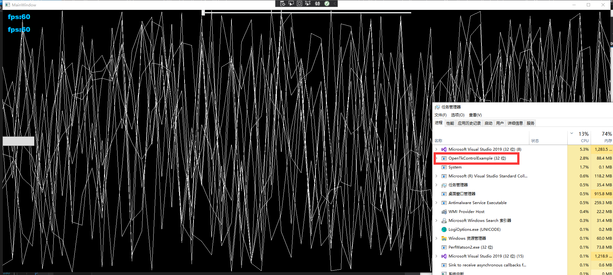

# Declaration
I've experienced a flickering on intel gpu when low fps on [GLWPFControl](https://github.com/opentk/GLWpfControl), 
I tried to solved it by use GL.Finish() but it'll be blocked frequently as opentk render run in ui thread. 
So I commenced combination of  [official project](https://github.com/opentk/GLWpfControl) and [background implementation](https://github.com/jayhf/OpenTkControl).

## Feature

1. OpenTK run in background thread, no blocking in ui thread, grand framerates.

2. Duo of DX9 and writeablebitmap approaches, high flexiblity.

3. Async GL.ReadPixel and double pixel buffer object in bitmap approach, high framerates and low cpu usage.

4. Test passed on NVIDIA GTX970 and Intel UHD630 GPU.

5. No flickering at any framerate.

