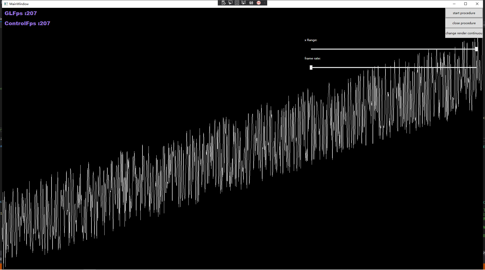
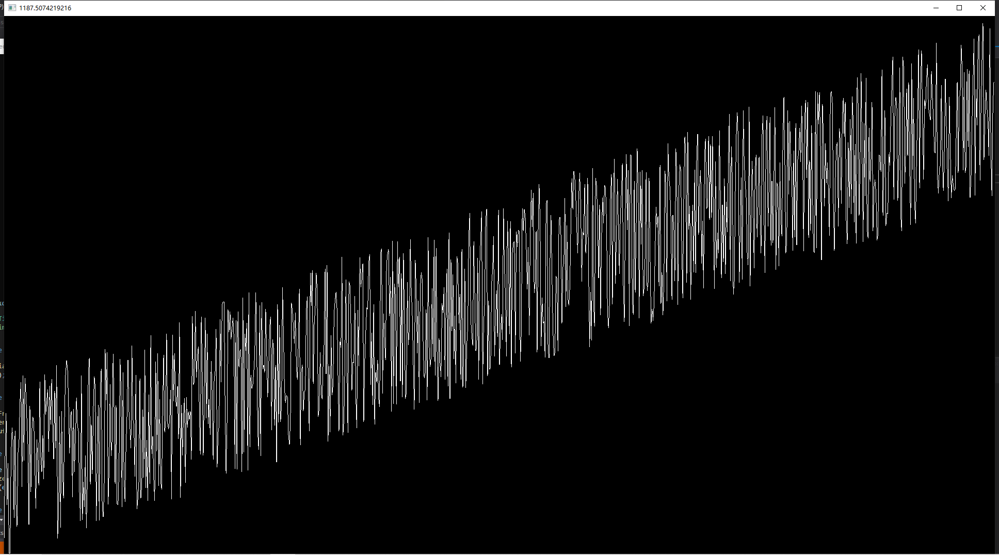

# Declaration
I've experienced a flickering on intel gpu when low fps on [GLWPFControl](https://github.com/opentk/GLWpfControl), 
I tried to solved it by use GL.Finish() but it'll be blocked frequently as opentk render run in ui thread. 
So I commenced combination of  [official project](https://github.com/opentk/GLWpfControl) and [background implementation](https://github.com/jayhf/OpenTkControl).

## Feature

0. Solved problem flickering in intel uhd gpu on low framerate when use offical [official library](https://github.com/opentk/GLWpfControl) (As offical library use d3dimage, It's very strange that intel uhd gpu will flicing on low framerate but my gtx970 will not. I'll discuss the phenomenon below.)

1. Render procedure run in separate thread, no blocking in ui thread.

2. Both d3dimage and writeablebitmap approaches, high flexiblity.

3. Enable MSAA.

4. Use dataflow to maximize fps .

5. Can stop and resume render; can preview render; can auto suspend render when control is user invisible, can set frame rate.

6. Provider a 2d coordinate chart example.

As wpf use dx to render any control. I've tried to use pipeline but frame rate hadn't boost, you can see it in branch net47-dev-datafoow.

The following shows gamewindow can reach about 1200 fps but my control only be limited to 200 use same render code.

So I suggest using opengl winform control for maximum fps.

